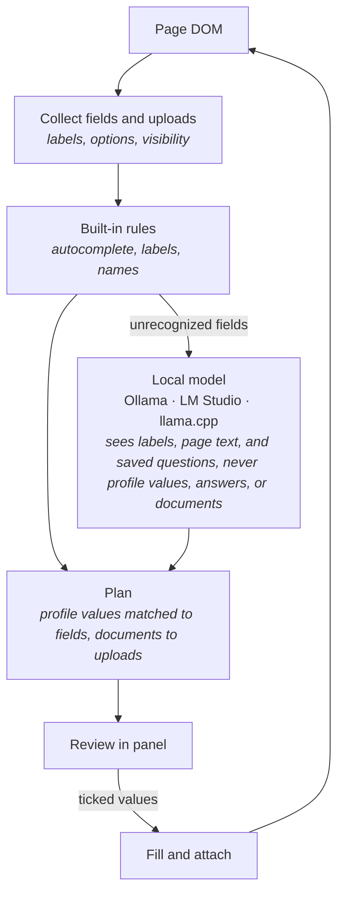

<p align="center">
  
</p>

# Offline Autofill

**Fill forms from a profile that never leaves your device.**

Offline Autofill is a zero-telemetry browser extension that fills web forms with your details: name, contact info,
addresses, education, and work history, and attaches your documents (resume, cover letter, transcript, photo) where a
form asks for them. Your profile and documents are stored only in your browser. Field recognition uses built-in rules
first and, for anything they don't recognize, a local model you already run - Ollama, LM Studio, llama.cpp server, or
any OpenAI-compatible localhost endpoint. The model sees the form's structure, the page's text, and the questions you
have saved, never a value from your profile, never an answer, and never a document.

## Why

Form fillers are useful and most of them are cloud services. Your name, address, and employment history are exactly the
data you should not hand to a third party in exchange for convenience. Everything here runs on hardware you control:

- **Your profile stays local.** Stored in the browser's extension storage, never uploaded, never synced by us.
- **Your documents too.** Keep a resume, cover letter, transcript, or photo in the extension and it is attached to
  the matching upload field, the way you would pick it from the file dialog. Several resumes? Choose in the review.
- **The model never sees your profile.** It maps field labels to profile keys ("Institution attended" means
  `education.institution`) and upload labels to document kinds ("Lebenslauf" means a resume); the extension fills
  the values and attaches the files itself. Nothing you stored is ever in a prompt.
- **Works without a model.** Well-annotated forms are handled by deterministic rules alone. The model only shortens the
  "not recognized" list.
- **Review before fill.** Every value is listed before it is written; untick anything you don't want.
- **Remembers your answers.** Questions no profile covers ("Why do you want to work here?", "Desired salary") you
  answer once by hand. Click **Save answers**, tick what to keep, and the next form that asks the same question is
  filled from them. Values are read from a page only when you click; the model sees the saved questions, never the
  answers.
- **Know what you're filling.** Each scan describes the form: what it is for, how to complete it, what it asks you to
  attach, and what it wants that the extension will never fill. The built-in rules outline it; the local model, when
  on, explains it.
- **Never fills what it shouldn't.** Passwords, one-time codes, cards, bank accounts, and government IDs are refused on
  sight. Hidden and off-screen fields (honeypots) are never touched.
- **Repeating sections.** Several addresses, degrees, and jobs; forms that number their fields get the right entry in
  the right row.

## How it works



Collection, mapping, planning, and filling are pure logic in `packages/core`, testable against static HTML fixtures
without a browser. The engines are thin HTTP clients in the extension that implement the `FieldMapper` and
`FormSummarizer` contracts core defines, with the model's answer constrained to a JSON schema. Nothing in any code path sends page content, profile
data, or prompts to a remote host; the manifest requests localhost access only.

## Status

Early. The pipeline works end to end and is tested, and the panel has a profile editor, documents, a scan-and-review
flow, saved answers, and settings. Not yet done, in rough order:

- Profile encryption with a passphrase. Until then the profile and documents sit in extension storage as plain data,
  isolated from web pages and other extensions but readable from the browser profile on disk.
- Date pickers and custom dropdowns without ARIA combobox roles (ARIA comboboxes such as react-select are filled).
- Remembering a site's field mapping so repeat visits skip the model.
- Assigning a key by hand to an unrecognized field from the panel.
- Saving an answer from the page's own context menu, one field at a time.

## Backends

| Backend       | Prerequisites                                                  | Typical models                   |
|:--------------|:---------------------------------------------------------------|:---------------------------------|
| **Ollama**    | [Ollama](https://ollama.com) running locally                   | `llama3.2`, `qwen2.5:7b`, `phi3` |
| **LM Studio** | [LM Studio](https://lmstudio.ai) with its local server enabled | any loaded chat model            |
| **llama.cpp** | `llama-server` on a localhost port                             | any GGUF chat model              |

The mapping task is small (a list of labels in, a list of keys out), so 3B to 8B models do well. The form summary
sends the model the page title, headings, intro text, button labels, and field labels - never your profile.

## Try it

`demo/` holds a job application page for a fictional company, a sample profile, and a sample resume and cover letter.
Load the profile and the documents as `demo/README.md` describes, open `demo/index.html`, and scan. Nothing on that
page is real and nothing entered there is sent anywhere.

## Install

- Chrome / Edge: not yet listed on the Chrome Web Store - build and load it from source below.
- Firefox: not yet listed - build and load it from source below.

## Quick start (developer mode)

1. Build the extension:

   ```sh
   pnpm install
   pnpm build            # dist/chrome + dist/firefox
   ```

2. Load it:
    - Chrome / Edge: open `chrome://extensions`, enable **Developer mode**, click **Load unpacked**, select
      `dist/chrome`.
    - Firefox: open `about:debugging`, click **Load Temporary Add-on**, select `dist/firefox/manifest.json`.

3. Open the panel, go to **Profile**, enter your details, and save. Under **Documents**, add a resume or anything
   else forms ask you to attach (up to 10 MB each).

4. Optionally start a local runtime. Ollama must be told to accept browser-extension origins:

   ```sh
   OLLAMA_ORIGINS="chrome-extension://*,moz-extension://*" ollama serve
   ollama pull llama3.2
   ```

   For LM Studio, start the server in the Developer tab; for llama.cpp, run `llama-server -m <model.gguf> --port 8080`.
   Pick the engine and model under **Settings**. Without a runtime the extension still works with its built-in rules.

5. On a page with a form, click **Scan this page**, review the values and attachments, and click **Fill**.

6. Answer the rest by hand, then click **Save answers**, tick what to keep, and save. Saved answers appear under
   **Profile** and fill the same questions on the next form.

## Layout

```
packages/
  core/            # pure logic, no browser APIs: profile, documents, field and upload collection, mapping, planning, filling, answer capture
  extension/
    platform/      # the only files that differ per browser, behind the Platform interface
    background/    # settings, stored profile and documents, engine clients, scan/fill orchestration
    content/       # thin: collects fields and uploads, applies approved writes, reads values only on "Save answers"
    panel/         # fill view, profile editor, documents, settings (sidepanel on Chrome, popup on Firefox)
  shared/          # protocol types only
manifests/         # base.json + chrome.json / firefox.json overlays, merged at build
fixtures/          # static HTML forms core is unit-tested against
scripts/           # esbuild-based build
```

## Commands

```sh
pnpm install
pnpm build            # dist/chrome and dist/firefox
pnpm build:chrome
pnpm build:firefox
pnpm test
pnpm typecheck
```

## Related

[Offline TL;DR](https://github.com/dkobia/offline-tldr) summarizes pages the same way: on-device, local models only,
zero telemetry.

## License

[MIT](LICENSE)
